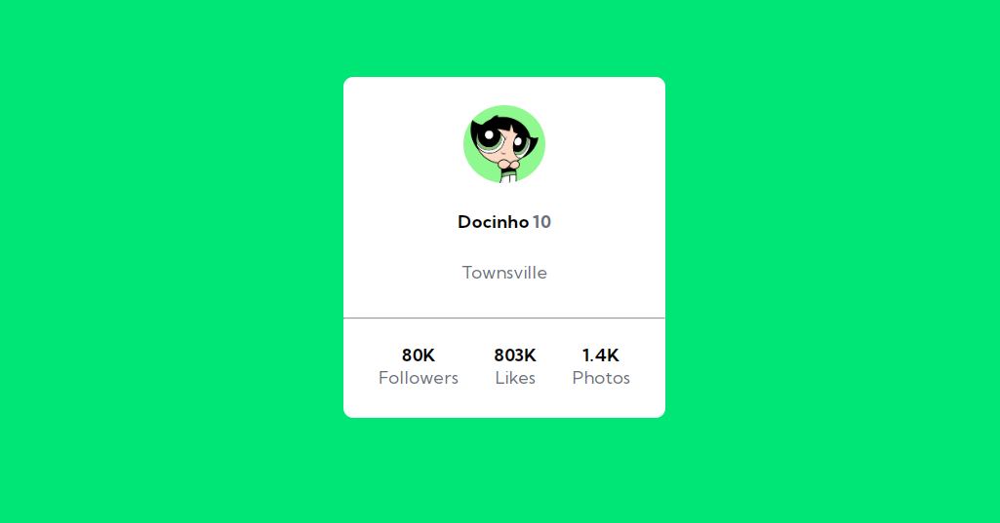

# Profile card component

Solução do exercício baseado no projeto do Frontend Mentor, o Profile card component. 
Resolvi colocar as informações de perfil em um card mais personalizado. 

[]

## Meu processo

### Tecnologias utilizadas

- HTML
- CSS

### O que aprendi

Uso do flexbox para melhor posicionar os elementos na página, e os benefícios de criar variáveis para aplicação das cores.  
 
